# Telecom Social Listening Taxonomy (Canonical)

This document defines the **four-level hierarchical taxonomy** used for analyzing social media posts about **T-Mobile US** (client) and its main competitors **AT&T Mobility** and **Verizon**. It guides Claude in **topic discovery, post classification, and dashboard metrics aggregation**.

> **Client:** T-Mobile US | **Competitors:** AT&T Mobility, Verizon
> **Taxonomy Version:** v1.0.0 — 2026-03-15
> **Status:** Locked for current cycle. See `TAXONOMY-VERSIONING.md` for update rules.

**Hierarchy:**

```
Pillar → Category → Theme → Topic
```

**Pillars (6):** Network Performance | Customer Experience | Pricing & Plans | Device & Equipment | Data & Privacy | Competitive Switching

---

## Pillar: Network Performance

### Coverage
- **Urban Coverage** → signal loss in downtown, subway dead zones
- **Rural Coverage** → rural gaps, highway dead zones

### Speed
- **Data Speed** → slow LTE, slow 5G, throttling

### Reliability
- **Outages** → intermittent drops, network down, service disruptions

### 5G Experience
- **5G Availability** → missing 5G in supported zones, 5G not activating
- **5G Performance** → inconsistent mid-band, unstable connections, slow mmWave

---

## Pillar: Customer Experience

### Support
- **Call Center** → long wait times, unhelpful reps, escalation failures
- **Chat Support** → bot loops, no resolution, agent handoff failures

### Retail
- **Store Experience** → long waits, poor staffing, misinformation from reps

### Digital Experience
- **App** → crashes, login issues, T-Life app problems
- **Website** → payment errors, navigation failures, account portal issues

---

## Pillar: Pricing & Plans

### Billing
- **Billing Transparency** → unexpected charges, hidden fees
- **Auto-Pay** → missing discounts, auto-pay not applied

### Plan Structure
- **Plan Value** → expensive plans, unclear feature differences
- **Promotions & Deals** → advertised deal not honored, promo credit delays, Go5G promo issues

### Fees
- **Activation Fees** → surprise activation or upgrade fees
- **Early Termination** → ETF disputes, cancellation difficulties

---

## Pillar: Device & Equipment

### Upgrades
- **Upgrade Eligibility** → upgrade denial, eligibility confusion

### Trade-Ins
- **Trade-In Credits** → delayed credits, credits not applied, lower-than-quoted value

### Equipment Issues
- **Routers** → overheating, dropping connections, home internet equipment
- **Phones** → defective units, battery issues, software problems

---

## Pillar: Data & Privacy

### Data Throttling
- **Deprioritization** → speed reduced during congestion, throttling after data cap
- **Hotspot Limits** → hotspot speed reduced, hotspot data caps

### Privacy Concerns
- **Data Sharing** → carrier data sharing with third parties, location data concerns
- **Account Security** → SIM swapping, unauthorized account changes

---

## Pillar: Competitive Switching

### Switching Intent
- **Leaving Brand** → intent to leave T-Mobile, Verizon, or AT&T for a competitor
- **Joining Brand** → post-switch praise or complaints, port-in experience

### Carrier Comparison
- **Head-to-Head** → direct comparison of two or more carriers on specific attributes
- **Loyalty & Retention** → long-term customer treatment, loyalty rewards, retention offers

---

## Notes & Usage

- **Taxonomy is locked per cycle.** Do not add, rename, or remove nodes mid-cycle. Topics that do not fit any node are classified as `pillar: "Uncategorized"` and logged as drift candidates for the next cycle.
- **Taxonomy updates** follow semantic versioning in `TAXONOMY-VERSIONING.md`: new topic = patch, new theme = minor, new/renamed pillar = major.
- **Normalization:** Map similar topic mentions consistently (e.g., "slow LTE" and "LTE slow" both map to Speed → Data Speed → slow LTE).
- **T-Mobile-specific topics:** "Promotions & Deals" (Go5G, Magenta Max promos), "T-Life App" (under Digital Experience), and "5G Performance" (mid-band, mmWave) are T-Mobile-dominant conversation areas and are seeded in the taxonomy for that reason.
- **Integration:** Feeds the **executive dashboard** and underpins trend analysis, sentiment aggregation, and intent detection.

---

## Visual Taxonomy (Mermaid Diagram)

```mermaid
graph TD
    %% Pillars
    NP[Network Performance]
    CE[Customer Experience]
    PP[Pricing & Plans]
    DE[Device & Equipment]
    DP[Data & Privacy]
    CS[Competitive Switching]

    %% Network Performance
    NP --> NCov[Coverage]
    NP --> NSpeed[Speed]
    NP --> NReliab[Reliability]
    NP --> N5G[5G Experience]

    NCov --> Urban[Urban Coverage]
    NCov --> Rural[Rural Coverage]
    NSpeed --> DataSpeed[Data Speed]
    NReliab --> Outages[Outages]
    N5G --> Avail[5G Availability]
    N5G --> Perf[5G Performance]

    %% Customer Experience
    CE --> Support[Support]
    CE --> Retail[Retail]
    CE --> Digital[Digital Experience]

    Support --> CallCenter[Call Center]
    Support --> ChatSupport[Chat Support]
    Retail --> StoreExp[Store Experience]
    Digital --> App[App]
    Digital --> Website[Website]

    %% Pricing & Plans
    PP --> Billing[Billing]
    PP --> PlanStructure[Plan Structure]
    PP --> Fees[Fees]

    Billing --> Transparency[Billing Transparency]
    Billing --> AutoPay[Auto-Pay]
    PlanStructure --> Value[Plan Value]
    PlanStructure --> Promos[Promotions & Deals]
    Fees --> Activation[Activation Fees]
    Fees --> ETF[Early Termination]

    %% Device & Equipment
    DE --> Upgrades[Upgrades]
    DE --> TradeIns[Trade-Ins]
    DE --> EquipIssues[Equipment Issues]

    Upgrades --> Eligibility[Upgrade Eligibility]
    TradeIns --> Credits[Trade-In Credits]
    EquipIssues --> Routers[Routers]
    EquipIssues --> Phones[Phones]

    %% Data & Privacy
    DP --> Throttling[Data Throttling]
    DP --> Privacy[Privacy Concerns]

    Throttling --> Deprio[Deprioritization]
    Throttling --> Hotspot[Hotspot Limits]
    Privacy --> DataSharing[Data Sharing]
    Privacy --> AcctSecurity[Account Security]

    %% Competitive Switching
    CS --> Intent[Switching Intent]
    CS --> Compare[Carrier Comparison]

    Intent --> Leaving[Leaving Brand]
    Intent --> Joining[Joining Brand]
    Compare --> HeadToHead[Head-to-Head]
    Compare --> Loyalty[Loyalty & Retention]
```


